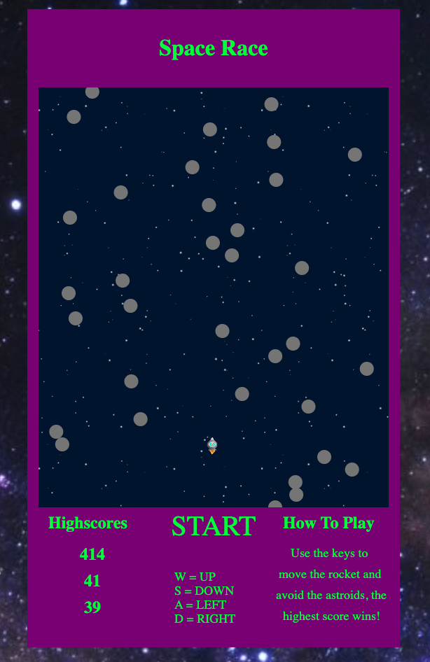
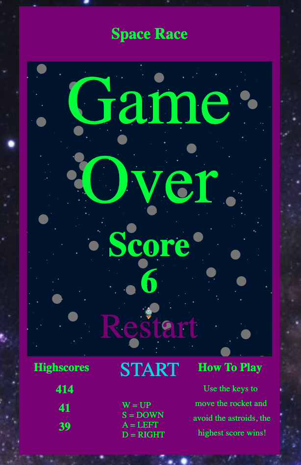
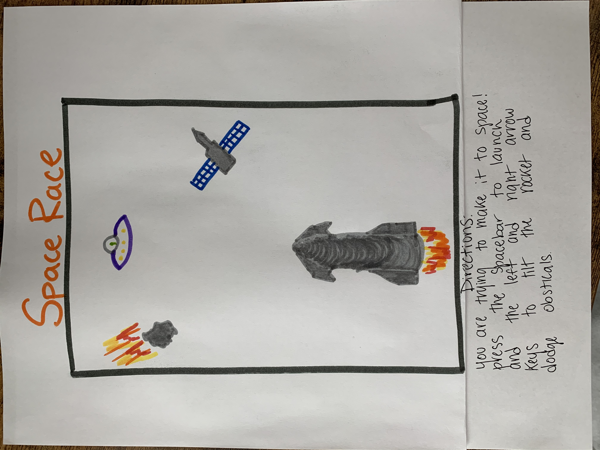

# Space-Race
This is a 2D game I built out as my first javascript project. It was inspired by my love for space and highscore-based arcade games.

## [Live Site](https://jaxonnarramore.github.io)

## Steps to install on local computer
1. `Fork` and `clone` repo
2. Clone to local machine
```text
git clone https://github.com/JaxonNarramore/Space-Race.git
```
3. Go to `Space-Race` directory
4. Open `index.html` in browser
```text
open index.html
```
## Features
- User input for rocket movement 
- Implementation of HTML Canvas
- Implementation of local storage for highscore keeping
- Sprite animation for rocket direction

## Controls
To control the rocket you use the W, A, S, D keys.
```
W = Up
S = Down
A = Left
D = Right
```

## Game Images





## Wireframes



## Animation of the canvas

```javascript
function animate() {
        var time = Date.now();
        if (time > (lastSpawn + spawnRate)) {
            lastSpawn = time;
            spawnRandomAstroid();
        }
        stop = requestAnimationFrame(animate);

        ctx.clearRect(0, 0, game.width, game.height);

        // Spawning astroids at the top of the canvas
        ctx.beginPath();

        ctx.moveTo(0, spawnLineY);

        ctx.lineTo(game.width, spawnLineY);

        ctx.stroke();
        
        // Itterating through astroids array 
        for (var i = 0; i < astroids.length; i++) {
            var astroid = astroids[i];

            // Spawning of astroids and moving them down the page
            astroid.y += spawnRateOfDescent;

            ctx.beginPath();

            ctx.arc(astroid.x, astroid.y, 10, 0, Math.PI * 2);

            ctx.closePath();

            ctx.fillStyle = astroid.type;

            ctx.fill();
        }
        // Itterating through astroids array for collision detection
        for (let i = 0; i < astroids.length; i++) {
            collisionDetection(astroids[i], rocket)
        }
        // Movement of rocket 
        if (keys.w) {
            if (rocket.y - 5 > 0){
                rocket.y -= 1.5
                rocket.frameX = 2;
            }
        } 
        if (keys.a) {
            if (rocket.x - 5 > 0){
                rocket.x -= 1.5
                rocket.frameX = 0;
            }
        } 
        if (keys.s) {
            if (rocket.y + rocket.height + 5 < game.height) {
                rocket.y += 1.5
                rocket.frameX = 2;
            }
        } 
        if (keys.d) {
            if (rocket.x + rocket.width + 5 < game.width) {
                rocket.x += 1.5
                rocket.frameX = 4;
            }
        }
        // Rendering sprite onto the canvas
        drawSprite(rocketSprite, rocket.width * rocket.frameX, rocket.height * rocket.frameY, rocket.width, rocket.height, rocket.x, rocket.y, rocket.width, rocket.height);

        handleRocketFrame();
    }
```

## Collision detection for astriods and rocket

```javascript
function collisionDetection(astroid, rocket) {
        var distX = Math.abs(astroid.x - rocket.x - rocket.width / 2);  
        var distY = Math.abs(astroid.y - rocket.y - rocket.height / 2);

        if (distX <= (rocket.width / 1.1) && distY <= (rocket.height / 2)) {
        // Game over conditions
        document.getElementById('game-over').innerHTML = 'Game Over';

        document.getElementById('game-over-button').innerHTML = 'Restart';

        restartButton = document.getElementById('game-over-button');

        restartButton.addEventListener('click', gameRestart);

        end();

        cancelAnimationFrame(stop)

        document.getElementById('scoretext').innerHTML = 'Score';
        }
        
        // More collision detection math
        var dx = distX - rocket.width / 2;

        var dy = distY - rocket.height / 2;

        return (dx * dx + dy * dy <= (astroid.r * astroid.r));
    }
```

## Highscore keeping / storing / displaying

```javascript
    function end() {
        endTime = new Date();

        var timeDiff = endTime - startTime; 

        timeDiff /= 1000;

        let seconds = Math.round(timeDiff);

        // Displaying score
        document.getElementById('score').innerHTML = seconds;

        const finalScore = document.getElementById('score');

        // Highscore local data storing 
        const mostRecentScore = localStorage.getItem('mostRecentScore')

        let highScores = JSON.parse(localStorage.getItem('highScores')) || [];

        finalScore.innerText = mostRecentScore;

        const score = { score: seconds };

        highScores.push(score);

        highScores.sort((a, b) => b.score - a.score);

        highScores.splice(3);

        localStorage.setItem('highScores', JSON.stringify(highScores));

        document.getElementById('score').innerHTML = seconds;
    }
});
    
// Highscore displaying 
const highScoreList = document.getElementById('highscore');

const highScores = JSON.parse(localStorage.getItem('highScores')) || [];

highScoreList.innerHTML = highScores.map(score => {
    return `<li>${score.score}</li>`;
}).join('');
```

## Contact with creator 

Email Adress: jaxon_narramore@hotmail.com

